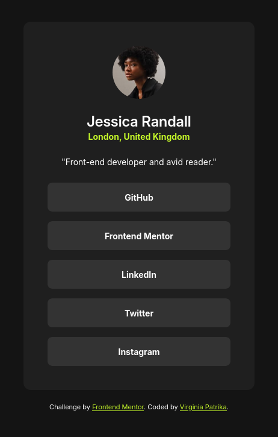

# Frontend Mentor - Social links profile solution

This is a solution to the [Social links profile challenge on Frontend Mentor](https://www.frontendmentor.io/challenges/social-links-profile-UG32l9m6dQ). Frontend Mentor challenges help you improve your coding skills by building realistic projects.

## Table of contents

- [Overview](#overview)
  - [The challenge](#the-challenge)
  - [Screenshot](#screenshot)
  - [Links](#links)
- [My process](#my-process)
  - [Built with](#built-with)
  - [Useful resources](#useful-resources)
- [Author](#author)
- [Acknowledgments](#acknowledgments)

## Overview

-This challenge was to build out a social links profile.

### The challenge

Users should be able to:

- See hover and focus states for all interactive elements on the page

### Screenshot

### Links

- Solution URL: [Github](https://github.com/VirginiaPat/social-links-profile-main.git)
- Live Site URL: [Netlify](https://social-links-profile-frontend-m-virgi.netlify.app/)

## My process

### Built with

- Semantic HTML5 markup
- CSS custom properties
- Flexbox

### Useful resources

- [Semantics in HTML1](https://developer.mozilla.org/en-US/docs/Glossary/Semantics#semantics_in_html)

## Author

- Frontend Mentor - [@VirginiaPat](https://www.frontendmentor.io/profile/VirginiaPat)
- Github - [VirginiaPat ](https://github.com/VirginiaPat)
- Netlify - [VirginiaPat](https://app.netlify.com/teams/virginia-patrika/sites)

## Acknowledgments

Special thanks to Kamran Kiani [@kaamiik](https://www.frontendmentor.io/profile/kaamiik) for his feedback.
